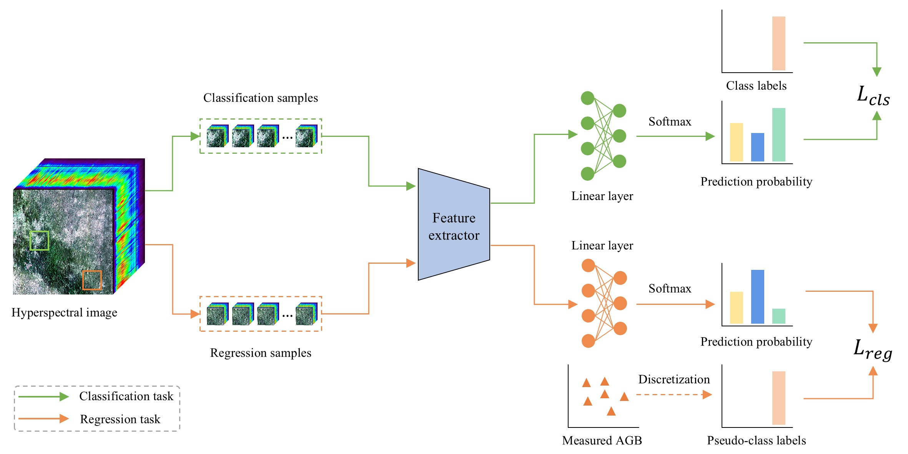
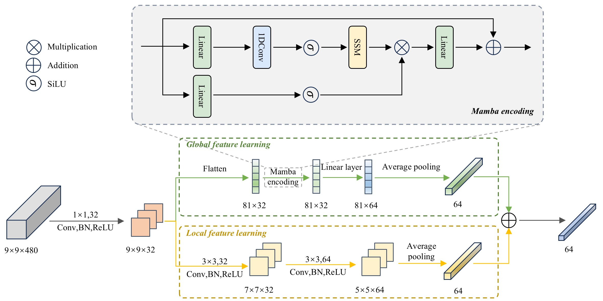

# [Cross-task collaborative learning for aboveground biomass estimation from UAV hyperspectral imagery in sample-scarce desert rangelands](https://doi.org/10.1016/j.compag.2025.111386)

Tao Zhang; Chuanzhong Xuan; Zhaohui Tang; Xinyu Gao; Suhui Liu; Yaobang Song; Qingjin Cao; Fei Cheng

<div align="center">
    
</div>


<div align="center">
    
</div>


## Citation
If this code is useful for your research, please cite this paper.
```
@article{zhang2026,
    author = {Tao Zhang and Chuanzhong Xuan and Zhaohui Tang and Xinyu Gao and Suhui Liu and Yaobang Song and Qingjin Cao and Fei Cheng},
    title = {Cross-task collaborative learning for aboveground biomass estimation from UAV hyperspectral imagery in sample-scarce desert rangelands},
    journal = {Computers and Electronics in Agriculture},
    year = {2026},
    month = {03},
    volume = {243},
    doi = {10.1016/j.compag.2025.111386},
}
```
Please contact me via email at: taozhang626@163.com 🤝
